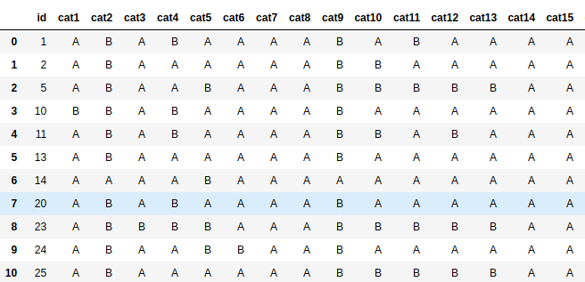
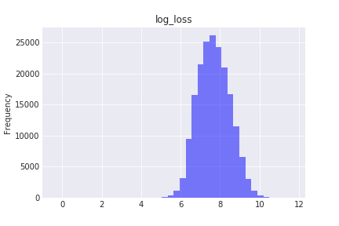
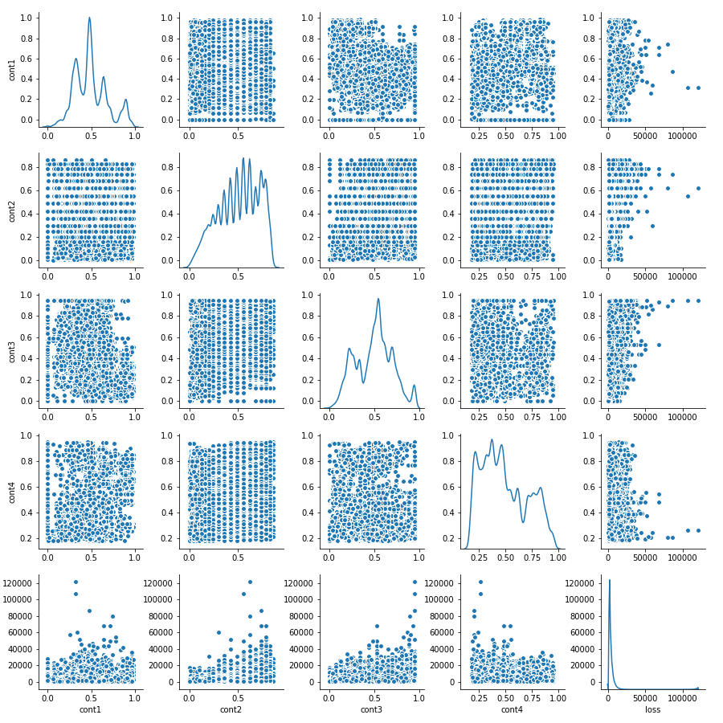
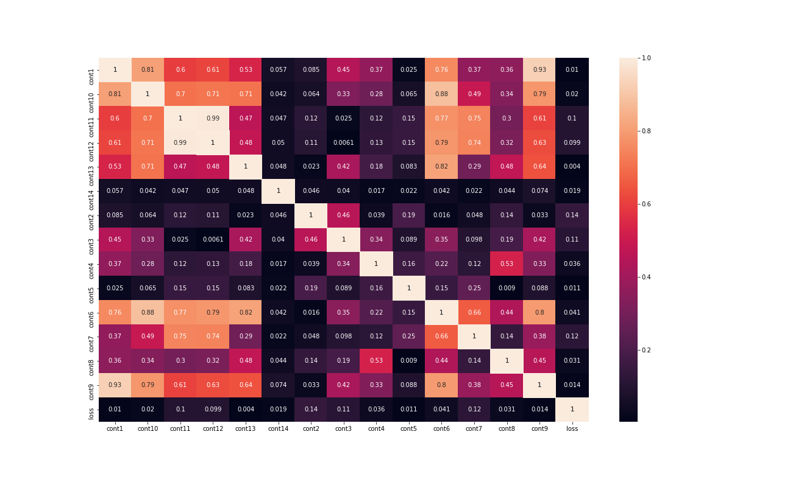

# Nanodegree Engenheiro de Machine Learning
## Projeto final
Bruno Aurélio Rôzza de Moura Campos

10 de fevereiro de 2019

## I. Definição
### 1.1 Visão geral do projeto
Quando ocorre um acidente de carro, as pessoas mantem o foco em família, amigos e outros entes queridos. A parte burocrática de entrar em contato com um agente de seguros é o último lugar que alguem vai gastar esforços. Para minimizar esforços na utilização de um serviço de sinistro será feito uma análise preditiva e assim, garatir a menor perda de tempo possível ao usuário.

### 1.2 Descrição do problema
O projeto será voltado a automatizar a previsão de custo e análise da gravidade de um sinistro. Como resultado, será possível garantir uma experiência mais eficiente aos clientes que necessitam. A seguradora que esta realizando o desafio, Allstate, forneceu os seguintes dados:
<br/>
1. Variáveis em train.csv e test.csv:
 - **id**: o id de um par de perguntas do conjunto de treinamento
 - **cat1** até **cat116**: variáveis de categoria (o intervalo de valores não é fornecido, nem os nomes das colunas).
 - **cont1** até **cont14**: variáveis contínuas (o intervalo de valores não é fornecido, nem os nomes das colunas).
 - **loss**: o valor que a empresa tem que pagar por uma determinada reivindicação. Esta é a variável de destino. - Em test.csv, a perda não está presente, já que vamos prever isso.

2. Em train.csv:
 - Número de linhas = 188318
 - Número de colunas = 132

3. Em test.csv:
 - Número de linhas = 125546
 - Número de colunas = 131

O problema é criar um algoritmo que prevê com precisão a gravidade das reivindicações. Como entrada, será recebido diferentes variáveis que os agentes examinam para decidir o status das reivindicações. Eles podem ser contínuos ou discretos. Como a variável de destino é uma quantidade contínua (o valor a ser pago ao cliente), é essencialmente uma função de regressão. Desta forma, analisando o objetivo da seguradora neste desafio, é possível notar o algoritmo resultante deverá fazer recomendações para os usuários.


### 1.3 Métricas
Há várias maneiras de avaliar este problema. Como a avaliação oficial deste projeto é feita pelo Kaggle usando erro absoluto médio (Mean absolute error - MAE), o mesmo será usado para avaliação de modelos entre a predição de perda e a perda atual reinvidicada, conforme consta nos datasets.
 Abaixo há a fórmula do MAE:


- _y_: valor True
- _ŷ_: valor predito
- n samples: número de exemplos estimados 

## II. Análise
### 2.1 Exploração dos dados
 Neste projeto foi utilizado a base de dados que a seguradora Allstate forneceu na competição do Kaggle contendo diversas informações técnicas (features).<br/>
 O conjunto de dados contém 2 arquivos .csv com informações necessárias para fazer uma previsão. Ao contatenar estes arquivos obtemos em torno de 318.5 MB com 132 colunas e 313864 linhas. Eles contem as seguintes features:<br/>
1. Features em train.csv e test.csv:
 - **id**: o id de um par de perguntas do conjunto de treinamento
 - **cat1** até **cat116**: variáveis de categoria (o intervalo de valores não é fornecido, nem os nomes das colunas).
 - **cont1** até **cont14**: variáveis contínuas (o intervalo de valores não é fornecido, nem os nomes das colunas).
 - **loss**: o valor que a empresa tem que pagar por uma determinada reivindicação. Esta é a variável de destino. - Em test.csv, a perda não está presente, já que vamos prever isso.

Cabe observar que em test.csv a coluna loss não esta presente pois é o que será predito.<br/>


### 2.2 Visualização exploratória
Nesta seção, você precisará fornecer alguma forma de visualização que sintetize ou evidencie uma característica ou atributo relevante sobre os dados. A visualização deve sustentar adequadamente os dados utilizados. Discuta por que essa visualização foi escolhida e por que é relevante. Questões para se perguntar ao escrever esta seção:
- _Você visualizou uma característica ou um atributo relevante acerca do conjunto de dados ou dados de entrada?_
- _A visualização foi completamente analisada e discutida?_
- _Se um gráfico foi fornecido, os eixos, títulos e dados foram claramente definidos?_


Ao analisar os dados fornecidos, observamos que que temos os seguites tipos de dados:
- int64(1) = id
- float64(15) = features continuas + loss
- object(116) = features categóricas

As imagens 1 e 2 são amostras dos dado de train e test.


Imagem 1. Amostra do arquivo de train.csv


Imagem 2. Amostra do arquivo de test.csv


### 2.3 Algoritmos e técnicas
A relação entre as _features_ de 130 (116 + 14) com a variável _loss_ é fundamentqal para compreensão do problema. Para isso, a solução devenvolvida utiliza a técnica de _Hybrid filtering_, para melhorar os resultados do sistema. Mais especificamente, o sistema utiliza o método de _ Feature-combination_  para determinar a similaridade das _features_.<br/>
Também uma técnica fundamental para o endentimento do preblema é analisar as correlações entre as _features_ para selecionar os melhores resultados. 
Na parte de exploração de dados foi convertido valores categóricos de alfabetos em números que podem ser mais fáceis de serem processados. <br/>
 Os modelos testados foram: 
 
 - **Regressão linear:** É o algoritmo estatístico no qual consiste em expressar a saída desejada na forma de função linear, onde cada instancia é relacionada com um peso. Sua principal vantagem é a simplicidade, sendo reconhecido como o algotimo mais simples de trabalhar com dados numéricos, cuntudo já as suas desvantagens consistem em trabalhar apenas com dados numéricos e sua eficiência em dados não lineares é baixa.
 
 
 - **XGBoost:** O XGBoost é uma biblioteca de otimização de gradiente distribuída otimizada projetada para ser altamente eficiente, flexível e portátil. Ele implementa algoritmos de aprendizado de máquina sob a estrutura Gradient Boosting. O XGBoost fornece um reforço de árvore paralela (também conhecido como GBDT, GBM) que resolve muitos problemas de ciência de dados de maneira rápida e precisa. O mesmo código é executado em ambientes distribuídos principais (Hadoop, SGE, MPI) e pode resolver problemas além de bilhões de exemplos.
 Este algortimo de boosting tem regularização para evitar overfitting, garante um processamento paralelo e ainda pode ser altamente flexivel, o XGBoost permite aos usuários definir personalizar objetivos de otimização e critérios de avaliação. Alem disso, o gerenciando valores faltantes (‘missing values’) pois ele possue rotinas internas para lidar com valores faltantes.
 Em relação à poda (prune) de árvores: XGBoost faz splits até o max_depth especificado e, em seguida, começa a podar a árvore de trás pra frente e remove as divisões para além das quais não há ganho positivo.
 
 
 - **Random Forest (Bagging):** Uma algortimo de classificação capaz de executar classificação em várias classes de conjunto de dados. Esse algoritmo requer pouca preparação dos dados e tem um custo logarítmico para o treinamento. Contudo, pode criar sistemas altamente complexos que não generalizam bem e assim ficarem instaveis pois pequenas variações nos dados podem resultar na geração de árvores compeltamente diferentes
 
 
 

### 2.4 Benchmark
Após esta preparação dos dados foi realizado testes com modelos de machine learning para verificar qual tem melhor performace usando a divisão do Kfold e, finalmente, calculado o o erro médio quadrático (MAE). <br/>

## III. Metodologia

### 3.1 Pré-processamento de dados
Foi necessário aplicar várias técnicas de processamento para preparar os dados. Abaixo segue a lista:<br/>
- Primeiramente, foi verificado se não havia valores "missing" em cada coluna.
- Em seguida, foi separar as features categoricas e features continuas, obtendo o seguinte resultado:<br/>
    <br/>
    Continuos Features: ['cont1', 'cont10', 'cont11', 'cont12', 'cont13', 'cont14', 'cont2', 'cont3', 'cont4', 'cont5', 'cont6', 'cont7', 'cont8', 'cont9'] 
    <br/>
    Categorical Features: ['cat1', 'cat10', 'cat100', 'cat101', 'cat102', 'cat103', 'cat104', 'cat105', 'cat106', 'cat107', 'cat108', 'cat109', 'cat11', 'cat110', 'cat111', 'cat112', 'cat113', 'cat114', 'cat115', 'cat116', 'cat12', 'cat13', 'cat14', 'cat15', 'cat16', 'cat17', 'cat18', 'cat19', 'cat2', 'cat20', 'cat21', 'cat22', 'cat23', 'cat24', 'cat25', 'cat26', 'cat27', 'cat28', 'cat29', 'cat3', 'cat30', 'cat31', 'cat32', 'cat33', 'cat34', 'cat35', 'cat36', 'cat37', 'cat38', 'cat39', 'cat4', 'cat40', 'cat41', 'cat42', 'cat43', 'cat44', 'cat45', 'cat46', 'cat47', 'cat48', 'cat49', 'cat5', 'cat50', 'cat51', 'cat52', 'cat53', 'cat54', 'cat55', 'cat56', 'cat57', 'cat58', 'cat59', 'cat6', 'cat60', 'cat61', 'cat62', 'cat63', 'cat64', 'cat65', 'cat66', 'cat67', 'cat68', 'cat69', 'cat7', 'cat70', 'cat71', 'cat72', 'cat73', 'cat74', 'cat75', 'cat76', 'cat77', 'cat78', 'cat79', 'cat8', 'cat80', 'cat81', 'cat82', 'cat83', 'cat84', 'cat85', 'cat86', 'cat87', 'cat88', 'cat89', 'cat9', 'cat90', 'cat91', 'cat92', 'cat93', 'cat94', 'cat95', 'cat96', 'cat97', 'cat98', 'cat99']
    <br/>
    <br/>
- Por fim, foi visualizado os valores únicos, e obtido algumas métricas:<br/>


|métricas| unique_values |
|:-------:|-------------:|
|count    | 116.000000|
|mean     |   9.818966|
|std      |  33.666807|
|min      |   2.000000|
|25%      |   2.000000|
|50%      |   2.000000|
|75%      |   4.000000|
|max      | 326.000000|


- Transformação da feature loss: Foi aplicado _log_ na feature loss para garantir uma distribuição mais gaussiana. Abaixo, há as imagens com as distribuições:<br/>


Imagem 3. Distribuição dos dados recebidos.


Imagem 4. Distribuição dos dados com aplicação logarítmica.


### 3.2 Implementação
No primeiro momento foi realizado o merge dos data sets de traning e test afim de obter uma noção geral do que havia sido fornecido para o desafio. Isso facilitou a análise das features e o entendimento dos objetivos deste desafio.<br/>
Em seguida foi feito um **_data cleanning_** para fazer as seguintes funções:
- Checar valor ausentes
- Separar _features_ categoricas e _features continuas_
- Checar valor únicos

Depois disso, foi realizado um **_data preprocessing_** para fazer as seguintes atividades:
- Transformação da _fature_ loss para log _loss_
- Conversão de valores com _string_ para valores numéricos

Na sequencia, se viu necessidade de realizar um **_feature engineer_** com os seguintes passos:
- Analisar graficamente a _feture loss_


Imagem 5. Distribuição da _feature_ loss.

- Analisar graficamente as _feature_ contínuas


Imagem 6. correlação das _features_ contínuas entre loss, 1 e 4.


Imagem 7. correlação das _features_ contínuas entre loss, 5 e 8.


Imagem 8. correlação das _features_ contínuas entre loss, 13 e 14.


Imagem 9. correlação de todas as _features_ contínuas e loss.

- Analisar a matriz de correlação das _feature_ contínuas


Imagem 10. Distribuição dos dados recebidos.

- Foi decido não analisar graficamente as _fetures_ categóricas pois havia muitas. Como mlehor sulução ainstao foi calculado e obtido uma lista com as 10 melhores correlações, conforme resultado abaixo:<br/>


Depois, foi analisado como deve ser feito a submissao e preparado o arquivo para isto.<br/>
 Após esta fase de data engineer, foi feito um _Split train and test_ e preparado a função _Mean absolute error (MAE)_ e a divisão com _K-Folds Cross_.


Para não repetir código, descidiu-se que uma função tranning seria útil nesta fase do projeto. Esta função faz as seguintes coisas:
- Calcula tempo de processamento
- Executa a predição em cada fold
- Calcula o MAE

Código da função de tranning:

```
def train_model(model, num_folds):
    """Function by Train model"""
        
    print("Begin training")
    start = time.time()
    
    # declare a KFold instance
    kfold = KFold(n_splits = num_folds, random_state = 10)
    
    # number of models
    num_models = 1
    
    # array to store results after each fold
    results = np.zeros((X_test.shape[0], k))
        
    # train K-1 Random Forests
    for i, (train, val) in enumerate(kfold.split(X_train)):
        # get smaller training set and create validation set
        X_train_mini, X_val = X_train.iloc[train], X_train.iloc[val]
        y_train_mini, y_val = y_train[train], y_train[val]

        # train model
        model.fit(X_train_mini, y_train_mini)

        # make predictions 
        preds = model.predict(X_val)
        
        # absolute error
        error = mean_absolute_error(np.exp(y_val) - shift, np.exp(preds) - shift)
        print("MAE on fold {} is {}".format(i, error))

        
        # Predict on test set
        test_predictions = np.exp(model.predict(X_test)) - shift
        
        # Sum predictions
        results[:,i] = test_predictions
        

    end = time.time()
    print("\nTraining done! Time Elapsed:", end - start, " seconds.")

    # Error over k folds
    avg_error = np.mean(results)

    return test_predictions
```

Ao finalizar a preparação dos dados foi feito um a aplicação dos modelos de machine learning que serão melhor detalhados na parte de refinamento.


### 3.3 Refinamento

Foi utilizado três modelos de machine learning:
- Linear Regression
  - A modelagem da regressão linear foi analisada com os dados normalizados e não normalizados e se chegou a conclusão que não há diferença no resultado final.
  - O melhor resultado ocorreu com um erro absoluto médio de 1791.1369743102152
  

- Random Forest (Bagging)
 - Foi testado o número de estimadores para 20, 50 e 100 para encontrar a modelagem com melhor performace. Como análise de resultado observou-se que o aumento do número de estimadores melhorou o score.
  - O melhor resultado ocorreu com um erro absoluto médio de 1854.7308563695506, sendo pior em relação a regressão linear.
  - Um problema observado foi que com o aumento de estimadores o tempo de processamento tambem aumentou consideravelmente.
  
- XGBoost
 - Foi realizado três diferentes modelagens para o XGBoost
 - Primeiramente foi utilizado uma estrutura de dados interna do XGBoost para garantir o uso de memória mais eficiente e assim treinar mais rápido.
 - Para este algoritmo se viu a necessidade de criar um método específico para realizar as seguintes funcionalidades:
  - calcular o tempo de processamento
  - embaralhar os dados durante cada fold
  - executar a predição
  - armazenar a predição num array
  - analisar a média de previsões sobre os folds
  - Abaixo, segue a função:
```
  def train_test_xgboost(model, early_stopping_rounds):
    kf = KFold(n_splits = k, shuffle = True, random_state = random_state)
    results = np.zeros((X_test.shape[0], k))
    
    for i, (train_index, val_index) in enumerate(kf.split(X_train)):
        print("Begin training and testing base model on fold {}".format(i))
        start = time.time()
        
        X_train_mini, X_val = X_train.iloc[train_index], X_train.iloc[val_index]
        y_train_mini, y_val = y_train[train_index], y_train[val_index]

        # train model
        model.fit(X_train_mini, 
                   y_train_mini, 
                   eval_metric = eval_error, 
                   eval_set = [(X_train_mini, y_train_mini), (X_val, y_val)], 
                   early_stopping_rounds = early_stopping_rounds,
                   verbose = False)

        end = time.time()
        print("Training time elapsed on fold {} is {}".format(i, end - start))
        
        # Predict on validation set 
        val_predictions = model.predict(X_val, ntree_limit = model.best_ntree_limit)
        error = mean_absolute_error(np.exp(y_val) - shift, np.exp(val_predictions) - shift)
        print("Error on fold {} is {} \n".format(i, error))
                
        # Predict on test set
        test_predictions = np.exp(model.predict(X_test, ntree_limit = model.best_ntree_limit)) - shift
        # Sum predictions
        results[:,i] = test_predictions    

    # Average predictions
    mean_results = results.mean(axis = 1)
    print(test_predictions.shape)
    return mean_results
```
  - A escolha dos parametro de cada um dos três modelos foi crucial para um melhor resultado.
  - Para reduzir o overfitting foi testado a profundidade da árvore com 5, 7 e 9 níveis.
  - Para reduzir a perda ao mínimo necessário em cada leaf da árvore foi testatdo o _gamma_ com 0 e 1.
  - Para garantir a soma mínima dos pesos das instancias foi testado o _min_child_weight_ com 5 e 6.
  - Um fato importante para se considerar é que foi mantido o parâmetro de _learning_rate_ com um valor default de 0.1.
  - Por fim, o melhor resultado ocorreu com um erro absoluto médio de 1753.6550894377651, sendo o melhor resultado do projeto.

## IV. Resultados

### Modelo de avaliação e validação
Para avaliar cada algoritmo de machine learning testado foi utilizado o erro absoluto médio (MAE) com a seguinte implemetação:<br/>
```
# Custom eval metric
def eval_error(preds, dtrain):
    """evaluation"""
    labels = dtrain.get_label()
    return 'mae', mean_absolute_error(np.exp(preds), np.exp(labels))
```

Foi feito um comparativo entre a perda prevista e a perda real para cada afirmação do conjunto de testes. Isso garantiu a escolha do algoritmo melhor performático dentre os testados.<br/>

Já para validação dos dados foi utilizado _K-Folds Cross Validation_. O KFold divide todas as amostras em grupos de amostras, chamadas dobras de tamanhos iguais (se possível). A função de predição é aprendida usando dobras e a dobra deixada de fora é usada para teste. Foi implmentado da seguinte forma:<br/>

```
# replicate the results
random_state = 16

# folds
k = 5

# declare a KFold instance
kfold = KFold(n_splits = num_folds, random_state = 10)
```

Ao testar o algoritmo de XGBoost houve a necessidade de alterar a implementação, conforme abaixo:<br/>
```
kf = KFold(n_splits = k, shuffle = True, random_state = random_state)
```


### Justificativa
Após testar os três algoritmos, foi analisado qual obteve o menor erro absoluto médio. A conclusão que se chegou foi um MAE de 1753.6550894377651 para o XGBoost

## V. Conclusão

### Foma livre de visualização


### Reflexão
 Durante todo o projeto foi documentato da melhor forma possível através de notebooks. Essencialmente, este projeto consistiu em uma comparação de modelos de regressão linear, random forest e xgboot para criar predições encima dos dados fornecidos.<br/>
 O projeto foi revisado para garantir a melhor qualidade possível. Foi seguido as orientações da Udacity para deixar o trabalho padronizado. <br/>
 A parte de visualização dos dados foi útil para tomar as decisões sobre as técnicas usadas. Todos os gráficos gerados foram salvos para poder utilizar neste documento e assim melhor explicar as suas importancias. <br/>
 Ao final do projeto foi possível criar previsões muito boas, graças a forma que os dados foram tratados. Isso facilitou muito a aplicação dos algoritmos de machine learning.


### Melhorias
Uma possível melhoria para este caso de predição pode ser a utilização de redes neurais artificias trainadas para conseguir previsões mais refiandas e modelos mais potentes. Se houver a utilização de novas técnicas como redes neurais artificiais pode ser feito um comparativo com os modelos testados neste projeto.<br/>
A solução final pode ser usada como refencia pois houve a utilização e justificativa de cada modelo encima dos dados fornecidos e obitdo o melhor resultado na comparação.<br/>
